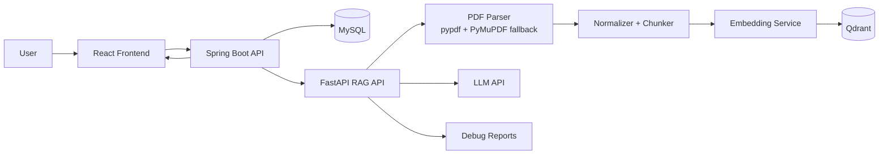

# MVP-Ready Full-Stack RAG Chatbot

A full-stack PDF RAG chatbot with React, Spring Boot, FastAPI, MySQL, Qdrant, and an LLM API. The project supports PDF upload, page extraction, chunking, embedding, vector search, chunk reports, and chat answers with source chunks.

This is positioned as an MVP-ready portfolio project with modular architecture. It is not described as fully production enterprise software yet.

## Tech Stack

- Frontend: React, Vite, Tailwind CSS, Axios
- Backend API: Spring Boot 3, Java 21, Spring Security JWT, Spring Data JPA
- RAG API: FastAPI, pypdf, PyMuPDF fallback, sentence-transformers, Qdrant client
- Storage: MySQL for metadata/chunks/chat history, Qdrant for vector search
- LLM: env-configured provider such as Google AI/Gemma-compatible or OpenAI-compatible API

## Architecture



## Main Features

- Register/login with JWT
- Upload PDF documents
- Unicode filename support
- PDF text extraction with parser fallback
- Clear detection for corrupt, encrypted, empty, and scan/image-only PDFs
- Page-aware chunking with chunk metadata
- Embedding and vector storage in Qdrant
- Chunk Report with status, pages, text length, chunks, parser, and errors
- Chat retrieval with source chunks and debug reports

## System Flow

1. User uploads a PDF from the React UI.
2. Spring Boot stores the file and document metadata.
3. Spring Boot calls the FastAPI RAG ingest endpoint.
4. RAG API validates, parses, normalizes, chunks, embeds, and stores chunks.
5. User asks a question in chat.
6. RAG API retrieves relevant chunks from Qdrant/MySQL fallback.
7. LLM generates an answer from selected chunks.
8. UI displays the answer, sources, retrieval report, and answer report.

## Folder Structure

```text
backend-spring/src/main/java/com/example/ragchatbot/
  auth/        controller, service, dto, security
  user/        entity, repository
  document/    controller, service, client, dto, entity, repository, mapper, exception
  chat/        controller, service, client, dto, entity, repository, mapper, exception
  common/      exception, security, web
  config/

frontend/src/
  app/         App, routes, layout
  features/    auth, documents, chat, dashboard, evaluation
  shared/      api, components, utils
  styles/assets through Vite public/style setup

rag-api/app/
  core/        config, logging, exceptions, constants
  api/v1/      health, documents, chat, debug
  schemas/     ingest, chat, chunk, retrieval, error
  pipelines/   ingest_pipeline, rag_pipeline
  services/    pdf, chunking, embedding, retrieval, llm, reports
  infrastructure/ mysql, qdrant, storage
  prompts/
  tests/
```

## Environment Variables

Use `.env.example` as the template. Keep real keys only in `.env`.

Key variables:

```env
DB_HOST=127.0.0.1
DB_PORT=3306
DB_DATABASE=rag
DB_USERNAME=raguser
DB_PASSWORD=ragpass

QDRANT_URL=http://localhost:6333
QDRANT_COLLECTION=rag_chunks
QDRANT_API_KEY=

LLM_PROVIDER=google
LLM_BASE_URL=https://generativelanguage.googleapis.com/v1beta
LLM_API_KEY=
LLM_MODEL=your-model-name
LLM_FALLBACK_MODEL=

JWT_SECRET=change-this-secret
RAG_API_URL=http://127.0.0.1:8001
VITE_API_BASE_URL=http://127.0.0.1:8080
```

Security note: do not commit `.env`, API keys, database passwords, or Qdrant keys.

## Run Locally

Start MySQL and Qdrant first. If Qdrant HTTP is unavailable, the RAG API can fall back to local Qdrant storage for development.

RAG API:

```powershell
cd rag-api
python -m venv .venv
.\.venv\Scripts\activate
pip install -r requirements.txt
python -m uvicorn app.main:app --host 127.0.0.1 --port 8001
```

Backend:

```powershell
cd backend-spring
mvn spring-boot:run
```

Frontend:

```powershell
cd frontend
npm install
npm run dev
```

Open:

- Frontend: `http://127.0.0.1:3000`
- Backend health: `http://127.0.0.1:8080/health`
- RAG health: `http://127.0.0.1:8001/health`
- RAG docs: `http://127.0.0.1:8001/docs`

## Test

Backend:

```powershell
cd backend-spring
mvn test
mvn -q -DskipTests package
```

Frontend:

```powershell
cd frontend
npm install
npm run build
```

RAG API:

```powershell
cd rag-api
python -m compileall app
.\.venv\Scripts\activate
python -m pytest tests
python scripts\ingest_pdf_smoke.py --api-url http://127.0.0.1:8001
```

## Manual Verification

1. Start RAG API, Spring Boot backend, and React frontend.
2. Register or log in.
3. Upload a Vietnamese-name PDF.
4. Confirm document status becomes `completed`.
5. Confirm `totalPages > 0` and `totalChunks > 0`.
6. Open Chunk Report and verify parser, text length, chunks, and errors are shown.
7. Open Chat, select the document, ask a question.
8. Confirm the answer includes source chunks.
9. Open Retrieval and Answer reports from the assistant message.

## Screenshots

Add screenshots here before publishing:

- Login
- Upload PDF
- Documents + Chunk Report
- Chat with source chunks
- Retrieval report

## Known Limitations

- OCR is not integrated yet. Scan/image-only PDFs are detected and reported as requiring OCR.
- Ingest is synchronous; large files should eventually move to a background job.
- Retry queues, rate limits, observability, and deployment hardening are not included yet.
- Current reranking is a placeholder boundary; retrieval uses vector score plus lightweight keyword scoring.
- Docker Compose should be reviewed before production-like deployment.

## Roadmap

- OCR integration for scanned PDFs
- Async/background ingest jobs
- Better reranking and hybrid BM25 retrieval
- Multi-document chat
- Docker Compose cleanup for MySQL/Qdrant/dev profiles
- CI/CD pipeline
- Structured observability and request tracing
- Auth hardening, rate limiting, and audit logs
