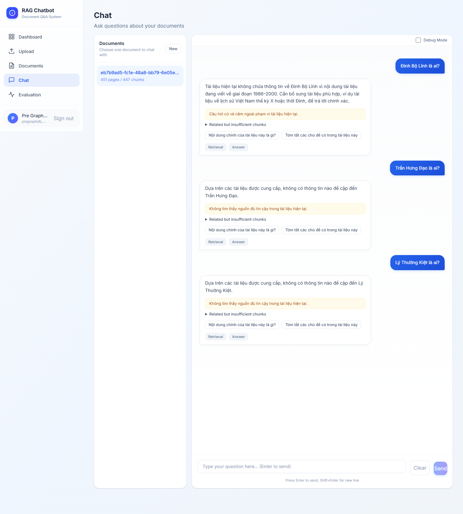
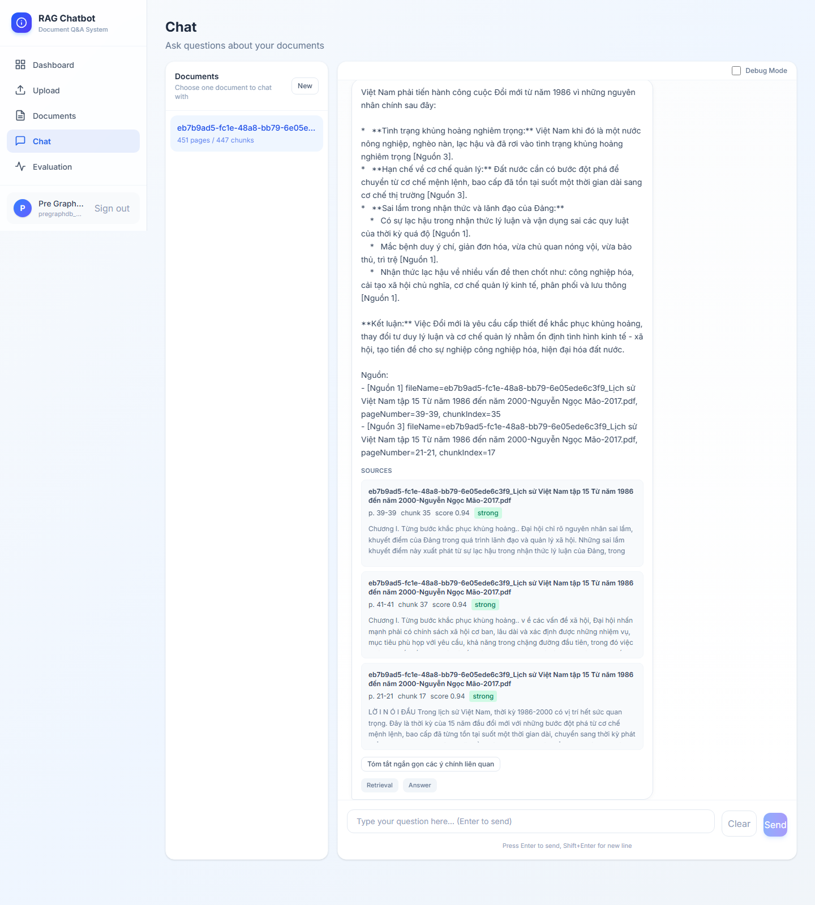
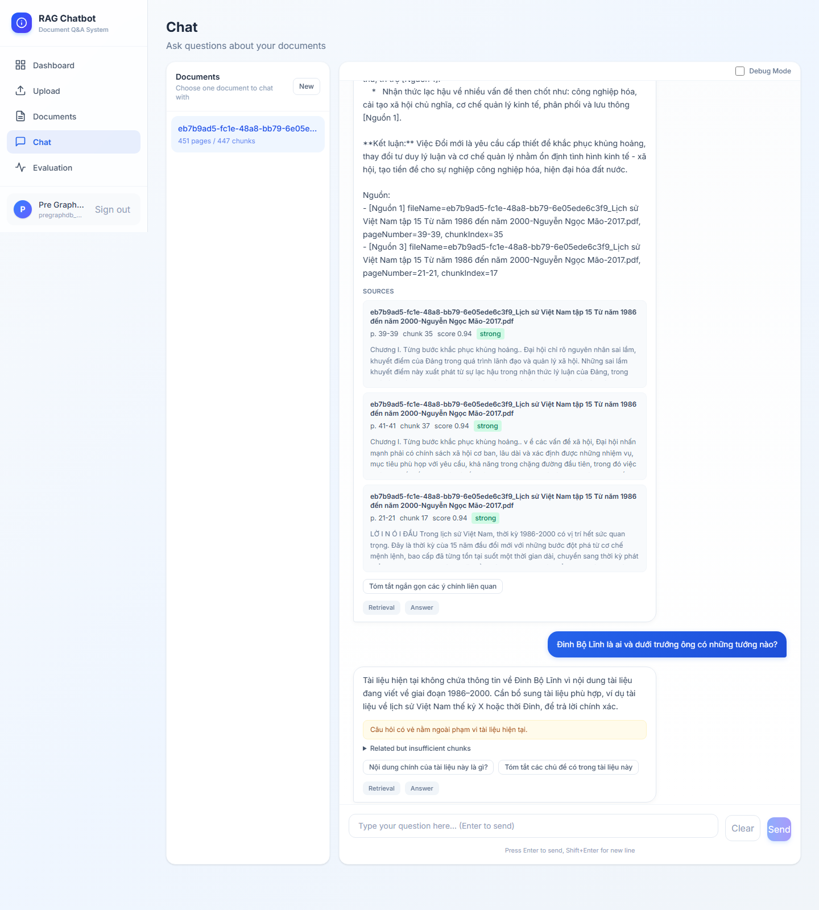
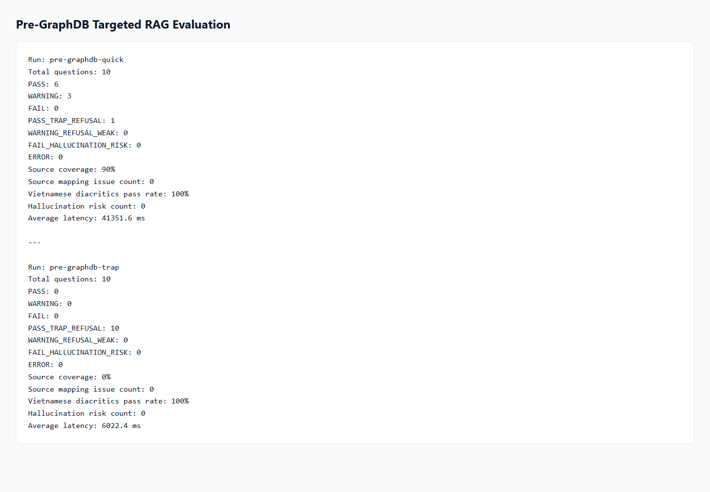

# RAG PDF Chatbot

## Project Overview

This project is a full-stack RAG chatbot for Vietnamese history document question answering. It is currently stabilized as the pre-GraphDB checkpoint: React frontend, Spring Boot backend, and FastAPI RAG service are wired together for upload, ingestion, retrieval, grounded answers, citations, chat history, and batch evaluation.

The active RAG phase focuses on a Vietnamese history PDF covering 1986-2000. The system prioritizes grounded answers and controlled refusal over unsupported claims.

## Current Features

- Upload and ingest PDF documents.
- Extract, normalize, chunk, and embed document text.
- Store metadata/chat history in the Spring Boot backend.
- Retrieve relevant chunks from the vector database.
- Answer Vietnamese questions with diacritics.
- Display citation/source cards with page, chunk, score, and preview metadata.
- Preserve chat message order so new user/assistant turns append at the bottom.
- Use controlled refusal for out-of-scope questions.
- Generate batch evaluation reports in TXT, CSV, and JSONL.
- Capture browser screenshots for chat order, citations, refusal, and evaluation evidence.

## Current Architecture

```text
React Frontend
   -> REST
Spring Boot Backend
   -> REST
FastAPI RAG Service
   ->
Vector DB / Document Chunks
   ->
LLM Answer + Sources
```

## RAG Flow

1. User asks a question.
2. Frontend appends the user message.
3. Backend stores the user message.
4. Backend calls the RAG API.
5. RAG retrieves relevant chunks.
6. Prompt builder creates grounded context.
7. LLM generates an answer.
8. RAG returns answer plus sources.
9. Backend stores the assistant message.
10. Frontend renders the latest answer at the bottom.

## Evaluation Summary

Latest targeted pre-GraphDB runs:

| Run | Total | PASS | WARNING | PASS_TRAP_REFUSAL | FAIL_HALLUCINATION_RISK | Source Mapping Issues |
| --- | ---: | ---: | ---: | ---: | ---: | ---: |
| pre-graphdb-quick | 10 | 6 | 3 | 1 | 0 | 0 |
| pre-graphdb-trap | 10 | 0 | 0 | 10 | 0 | 0 |

Earlier stabilization runs:

- `quick-source-fix`: total 10; Q10 `PASS_TRAP_REFUSAL`; `source_mapping_issue` count 0.
- `trap-after-refusal-fix`: E01-E10 `PASS_TRAP_REFUSAL`; `FAIL_HALLUCINATION_RISK` 0.
- `c-source-fix`: source mapping issue count 0.
- `a-source-fix`: still WARNING because person-specific queries are not directly supported by the current document chunks.

Do not read this as a 100% all-pass system. The current result is a stable RAG checkpoint with strong refusal behavior and known entity-retrieval limitations.

## Screenshots









## How To Run

RAG API:

```powershell
cd rag-api
python -m uvicorn app.main:app --host 127.0.0.1 --port 8001
```

Backend:

```powershell
cd backend-spring
.\mvnw.cmd spring-boot:run
```

Linux/macOS:

```bash
cd backend-spring
./mvnw spring-boot:run
```

Frontend:

```powershell
npm --prefix frontend run dev
```

The frontend defaults to Vite's dev port. Set `VITE_API_BASE_URL=http://127.0.0.1:8080` if needed.

## Tests

RAG API:

```powershell
cd rag-api
python -m py_compile scripts/batch_eval_history_rag.py
python -m pytest tests
```

Frontend:

```powershell
npm --prefix frontend run test:chat-order
npm --prefix frontend run build
```

Backend on Windows:

```powershell
cd backend-spring
$env:JAVA_HOME='C:\Program Files\Java\jdk-21'
.\mvnw.cmd test
```

Backend on Linux/macOS:

```bash
cd backend-spring
./mvnw test
```

## Evaluation Commands

```powershell
cd rag-api
python scripts/batch_eval_history_rag.py --groups Q --run-id pre-graphdb-quick --resume
python scripts/batch_eval_history_rag.py --from-jsonl storage/eval/rag_eval_history_pre-graphdb-quick.jsonl
python scripts/batch_eval_history_rag.py --groups E --run-id pre-graphdb-trap --resume
python scripts/batch_eval_history_rag.py --from-jsonl storage/eval/rag_eval_history_pre-graphdb-trap.jsonl
```

## Browser Screenshot Capture

The current screenshot helper drives a real local Chrome browser through Chrome DevTools Protocol. It does not use fake images.

```powershell
$env:DEMO_EMAIL='user@example.local'
$env:DEMO_PASSWORD='password'
$env:DEMO_DOCUMENT_ID='completed-document-id'
$env:FRONTEND_URL='http://127.0.0.1:5174'
$env:BACKEND_URL='http://127.0.0.1:8080'
node frontend/scripts/capture-rag-screenshots.mjs
```

The account must already have a completed document suitable for the RAG questions.

## Limitations

- Some person-specific questions about leaders such as Nguyen Van Linh, Do Muoi, and Vo Van Kiet can remain WARNING when the current chunks do not directly support the requested details.
- The system intentionally prefers refusal or partial answers over hallucination.
- Browser end-to-end demo depends on local services, a completed document, and valid backend/RAG credentials.
- GraphDB and GraphRAG are not implemented in this checkpoint.

## Next Phase: GraphDB / Mini GraphRAG

Planned next work:

- Add Neo4j.
- Extract entities and relations.
- Add graph retrieval for person-event-time relation questions.
- Keep citation/source tracking intact.
- Keep controlled refusal intact.
- Keep chat order and batch evaluation intact.
- Use the HisGraphRAG paper as research inspiration, while implementing a smaller Mini GraphRAG first.
