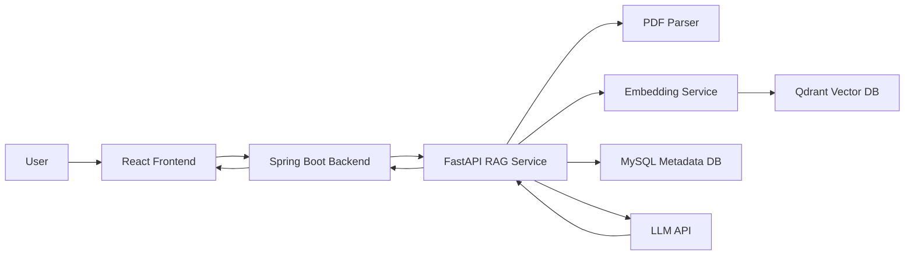

# RAG PDF Chatbot

MVP-ready full-stack RAG chatbot for PDF document question answering. The app lets users upload PDFs, inspect chunking/debug reports, and chat with document-grounded answers that include source chunks.

Built as a portfolio-grade project with modular React, Spring Boot, and FastAPI services. It is intentionally described as MVP-ready, not fully production-hardened.

## Demo Screenshots

| Login | Dashboard |
| --- | --- |
|  |  |

| Upload PDF | Documents |
| --- | --- |
|  |  |

| Chunk Report | Chat With Sources |
| --- | --- |
|  |  |


## Key Features

- Upload PDF documents
- Extract and chunk PDF content
- Store embeddings in Qdrant
- Store metadata and chat history in MySQL
- Chat with uploaded documents
- Show source chunks for answers
- Chunk report for RAG debugging
- Clear errors for corrupt, scanned, encrypted, and empty PDFs

## Architecture



## Tech Stack

| Layer | Technology |
| --- | --- |
| Frontend | React, Vite, Tailwind CSS, Axios |
| Backend | Spring Boot 3, Java 21, Spring Security JWT, Spring Data JPA |
| RAG API | FastAPI, pypdf, PyMuPDF, sentence-transformers |
| Data | MySQL, Qdrant |
| LLM | Google/Gemma-compatible or OpenAI-compatible API via env config |
| Tooling | Maven, npm, Playwright screenshot automation |

## System Flow

1. User uploads a PDF in the React UI.
2. Spring Boot stores file metadata and calls the RAG API.
3. FastAPI parses pages, normalizes text, chunks content, embeds chunks, and stores vectors.
4. User asks a question in chat.
5. RAG retrieves relevant chunks and builds context.
6. LLM generates an answer with source chunk metadata.
7. UI displays the answer, sources, and debug reports.

## Folder Structure

```text
backend-spring/   Spring Boot API, auth, documents, chat, DTOs, services
frontend/         React app organized by app/features/shared
rag-api/          FastAPI RAG service, pipelines, schemas, services, infrastructure
docs/screenshots/ README screenshots generated by Playwright
scripts/          Repository-level automation scripts
nginx/            Optional local reverse proxy config
```

## Run Locally

Prerequisites: Java 21, Maven, Node.js, Python, MySQL, and Qdrant.

```powershell
cp .env.example .env
```

RAG API:

```powershell
cd rag-api
python -m venv .venv
.\.venv\Scripts\activate
pip install -r requirements.txt
python -m uvicorn app.main:app --host 127.0.0.1 --port 8001
```

Backend:

```powershell
cd backend-spring
mvn spring-boot:run
```

Frontend:

```powershell
cd frontend
npm install
npm run dev
```

Open `http://127.0.0.1:3000`.

## Environment Variables

Use `.env.example` as the template. Keep real credentials in `.env` only.

```env
DB_HOST=127.0.0.1
DB_PORT=3306
DB_DATABASE=rag
DB_USERNAME=raguser
DB_PASSWORD=ragpass

QDRANT_URL=http://localhost:6333
QDRANT_COLLECTION=rag_chunks
QDRANT_API_KEY=

NEO4J_URI=neo4j+s://your-instance.databases.neo4j.io
NEO4J_USERNAME=neo4j
NEO4J_PASSWORD=
NEO4J_DATABASE=neo4j

LLM_PROVIDER=google
LLM_BASE_URL=https://generativelanguage.googleapis.com/v1beta
LLM_API_KEY=
LLM_MODEL=your-model-name

JWT_SECRET=change-this-secret
RAG_API_URL=http://127.0.0.1:8001
VITE_API_BASE_URL=http://127.0.0.1:8080
```

Security note: `.env`, logs, runtime storage, build outputs, and dependency folders are ignored by Git.

## Mini GraphRAG Phase 1

Phase 1 extracts entities and explicit relations from existing persisted document chunks (Qdrant payloads first, then MySQL fallback) and stores them in Neo4j AuraDB with chunk-level provenance. It is an offline build and inspection path only; it does not change `/rag/ask`, citations, source mapping, or refusal behavior.

Run from `rag-api` after configuring `.env`:

```powershell
python scripts/init_graph_schema.py
python scripts/build_graph_from_chunks.py --limit 5 --dry-run
python scripts/build_graph_from_chunks.py --limit 20
python scripts/build_graph_from_chunks.py --limit 20 --resume
python scripts/smoke_test_graph_rag.py
```

The builder checkpoints completed writes under `storage/graph/`, which is ignored by Git. Review sample extraction quality before increasing `--limit`; full-corpus ingestion is intentionally not part of this phase.

## Testing Commands

Backend:

```powershell
cd backend-spring
mvn test
mvn -q -DskipTests package
```

Frontend:

```powershell
cd frontend
npm install
npm run build
```

RAG API:

```powershell
cd rag-api
python -m compileall app
python -m pytest tests
python scripts\ingest_pdf_smoke.py --api-url http://127.0.0.1:8001
```

Screenshots:

```powershell
npm install
npx playwright install chromium
npm run capture:screenshots
```

The screenshot script uses mocked demo API data by default, so it does not need local secrets. Set `E2E_USE_MOCKS=false`, `E2E_EMAIL`, and `E2E_PASSWORD` to capture a real running environment.

## Known Limitations

- Scanned PDFs may require OCR setup.
- Local development requires frontend, backend, RAG API, MySQL, and Qdrant.
- Ingest is synchronous; large files should move to background jobs.
- Reranking is still lightweight.
- This is an MVP/portfolio project, not fully production-hardened.

## Roadmap

- OCR integration
- Async/background ingest jobs
- Better hybrid retrieval and reranking
- Multi-document chat
- Docker Compose profiles for local/dev
- CI/CD pipeline
- Observability, rate limiting, and auth hardening

## Literature Review Pipeline

The repository also contains a reproducible, source-traceable review pipeline for the question:
how multilingual embedding models compare with Vietnamese-specific embedding models on Vietnamese
retrieval tasks in news, legal, medical, and history domains.

Install the standalone review dependencies at repository root and run each reproducible stage:

```bash
python -m venv .lit-venv
source .lit-venv/bin/activate
pip install -r requirements.txt
python scripts/search_papers.py
python scripts/download_open_access_pdfs.py
python scripts/screen_papers.py
python scripts/extract_literature_matrix.py
python scripts/generate_reports.py
```

Set optional API etiquette/contact variables from `.env.example` in the shell before searching.
No key is printed or embedded in an output artifact. API response bodies are cached under
`cache/`, so identical reruns do not repeat successful remote requests.

### Search And Deduplication

`scripts/search_papers.py` runs the declared query set against Semantic Scholar, Crossref,
OpenAlex, arXiv, ACL Anthology, OpenReview, and DBLP. It writes query-level provenance to
`data/search_log.csv`, normalized candidate metadata to `data/papers_raw.csv`, and relevant
Hugging Face model-card links separately to `data/huggingface_model_sources.csv`. Google Scholar
queries are written to `data/google_scholar_manual_queries.md` for careful manual use; Google
Scholar is not scraped.

Records are merged by DOI, normalized title, arXiv identifier, and provider identifier including
Semantic Scholar paper ID. The retained paper metadata identifies every API source that supplied
the merged record.

### Legal PDF Retrieval

`scripts/download_open_access_pdfs.py` downloads a PDF only when metadata asserts open access and
the URL comes from a permitted source (Semantic Scholar `openAccessPdf`, arXiv, ACL Anthology, or
OpenReview) or a conservative open-repository host allowlist. A non-open or uncertain item remains
metadata-only. Download decisions and failures are retained in `data/pdf_download_log.csv`;
downloaded PDF files under `papers/pdf/` and API cache files are reproducible local artifacts and
are intentionally git-ignored.

### Screening And Evidence

`scripts/screen_papers.py` applies the documented inclusion/exclusion and 0-10 ranking criteria,
using metadata plus legally downloaded PDF text when available. It creates:

- `data/screened_papers.csv`
- `data/core_papers.csv`
- `data/supporting_papers.csv`
- `data/excluded_papers.csv`

`scripts/extract_literature_matrix.py` uses PyMuPDF to record a short source excerpt and page
number from each available core PDF, falling back explicitly to the abstract when no PDF is
available. It never infers a winning model or numerical result. Manually verify result tables and
update coded findings before academic submission.

`scripts/generate_reports.py` produces the PRISMA-style account, source-linked literature review
draft, proposal, model comparison evidence table, and BibTeX bibliography under `reports/` and
`references/`. Every paper-related statement in the draft points to a `paper_id` and
`citation_key` from `data/literature_matrix.csv`.
