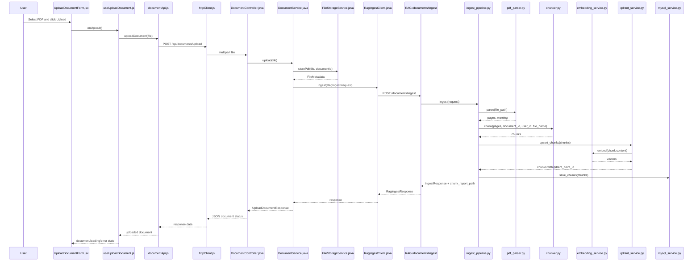
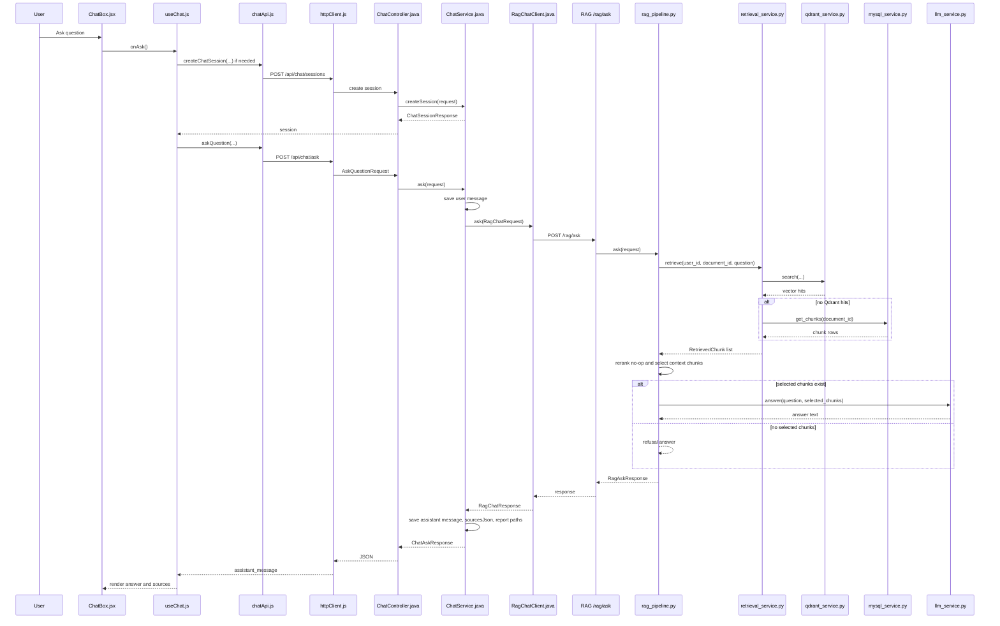

# End-to-End System Flow

This document describes the current MVP/portfolio architecture as implemented in this repository. It follows the real files and call paths in the codebase; it does not describe planned features as if they already exist.

## 1. System Overview

The project has three application layers plus two data stores:

- Frontend React: `frontend/src` renders document upload, document list, chunk report, and chat UI. It calls the Spring Boot API through `frontend/src/shared/api/httpClient.js`.
- Backend Spring Boot: `backend-spring/src/main/java/com/example/ragchatbot` owns authentication, user-scoped documents, chat sessions, chat messages, and calls the RAG API.
- RAG API FastAPI: `rag-api/app` parses PDFs, creates chunks, embeds chunks, writes vectors to Qdrant, writes chunk metadata to MySQL, retrieves chunks, and calls the LLM.
- MySQL: stores Spring entities and RAG chunk metadata. RAG API also initializes compatible tables in `rag-api/app/services/mysql_service.py`.
- Qdrant: stores chunk embeddings in collection `rag_chunks` by default, using cosine distance.
- LLM: called from `rag-api/app/services/llm_service.py` through either Google native API or an OpenAI-compatible client. If no client is configured, the service uses a local extractive fallback.

FastAPI currently mounts both legacy and v1 routes in `rag-api/app/main.py`. The Spring clients use the legacy routes:

- Ingest: `/documents/ingest`
- Chat: `/rag/ask`

The v1 routes `/api/v1/documents/ingest` and `/api/v1/chat/ask` exist, but they are not the routes used by the current Spring clients.

## 2. PDF Upload Flow

The upload flow starts in React and ends after the RAG API has parsed, chunked, embedded, persisted, and reported the document.

1. `frontend/src/features/documents/components/UploadDocumentForm.jsx`
   - Lets the user choose or drag/drop a PDF.
   - Performs client-side PDF accept/type handling.
   - Calls the `onUpload` prop when the upload button is clicked.

2. `frontend/src/features/documents/hooks/useUploadDocument.js`
   - `upload(file)` validates that a file exists.
   - Calls `uploadDocument(file)`.
   - Tracks `loading`, `error`, and returned `document`.

3. `frontend/src/features/documents/api/documentApi.js`
   - `uploadDocument(file)` creates `FormData`.
   - POSTs the file to `/api/documents/upload`.

4. `frontend/src/shared/api/httpClient.js`
   - Uses `VITE_API_BASE_URL` or `http://localhost:8080`.
   - Adds the JWT bearer token from `localStorage`.
   - Redirects to `/login` on `401` or `403`.

5. `backend-spring/.../document/controller/DocumentController.java`
   - `upload(@RequestParam("file") MultipartFile file)` handles `POST /api/documents/upload`.
   - Delegates to `DocumentService.upload(file)`.

6. `backend-spring/.../document/service/DocumentService.java`
   - Gets the current user from `CurrentUserProvider`.
   - Creates a `Document` entity.
   - Calls `FileStorageService.storePdf(file, document.id)`.
   - Saves the document with status `processing`.
   - Calls `RagIngestClient.ingest(...)`.
   - Applies the RAG response to `status`, `totalPages`, `totalChunks`, and `errorMessage`.

7. `backend-spring/.../document/service/FileStorageService.java`
   - Rejects empty files and filenames that do not end in `.pdf`.
   - Sanitizes the original filename.
   - Saves the file under `storage.path` with a name prefixed by `documentId`.
   - Verifies the file exists and has non-zero size.
   - Returns `FileMetadata`.

8. `backend-spring/.../document/client/RagIngestClient.java`
   - Uses `RestTemplate`.
   - POSTs `RagIngestRequest` to `{rag.api.url}/documents/ingest`.
   - Wraps failures in `RagIngestException`.

9. RAG API ingest endpoint
   - `rag-api/app/api/documents.py` defines `POST /documents/ingest`.
   - It calls `IngestPipeline.ingest(request)`.
   - `rag-api/app/api/v1/documents.py` also defines `POST /api/v1/documents/ingest`, but Spring is not using that route.

10. `rag-api/app/pipelines/ingest_pipeline.py`
    - Coordinates parse -> chunk -> embed/upsert -> MySQL persist -> chunk report -> `IngestResponse`.

## 3. RAG Ingest Flow

The real ingest implementation is:

1. `rag-api/app/pipelines/ingest_pipeline.py`
   - Creates `PdfParser`.
   - Calls `parser.parse(request.file_path)`.
   - Computes `text_length`.
   - Calls `Chunker(self.settings).chunk(...)`.
   - If no chunks are produced, returns status `failed` with a detailed `error_message`.
   - Calls `QdrantService(...).upsert_chunks(chunks)`.
   - Calls `_persist_chunks(chunks)` to save chunk rows in MySQL.
   - Calls `_write_report(...)`.
   - Returns `IngestResponse`.

2. `rag-api/app/services/pdf_parser.py`
   - This is the real parser implementation.
   - Validates `.pdf`, existence, file type, and non-empty file.
   - Tries `pypdf` first.
   - Falls back to `pymupdf` if pypdf fails or extracts no text and PyMuPDF is installed.
   - Produces `PageText` records with `page_number`, `text`, `char_start`, and `char_end`.
   - Sets report fields like `parser_used`, `total_pages`, `extracted_text_length`, `encrypted`, `is_scan_or_image_only`, `parser_errors`, and `page_errors`.

3. `rag-api/app/services/pdf/pdf_parser.py`
   - Compatibility wrapper that re-exports `app.services.pdf_parser.PdfParser`.

4. `rag-api/app/services/pdf/pdf_text_extractor.py`
   - Thin wrapper around `PdfParser.parse`.
   - It is present, but `IngestPipeline` currently calls `PdfParser` directly rather than using `PdfTextExtractor`.

5. `rag-api/app/services/chunking/text_normalizer.py`
   - Contains `TextNormalizer.normalize`.
   - It normalizes null characters and whitespace.
   - Current `Chunker` has its own `_normalize` method, so this class exists but is not called by `IngestPipeline`.

6. `rag-api/app/services/chunker.py`
   - Real chunking implementation.
   - Splits each page into words.
   - Uses a sliding word window controlled by `CHUNK_SIZE` and `CHUNK_OVERLAP`.
   - Does not merge text across pages.
   - Produces `Chunk` models.

7. `rag-api/app/services/chunking/chunker.py`
   - Compatibility wrapper that re-exports `app.services.chunker.Chunker`.

8. `rag-api/app/services/embedding_service.py`
   - Real embedding implementation.
   - Uses `sentence-transformers` with `normalize_embeddings=True` when available.
   - Falls back to deterministic hash embeddings when `FAST_TEST_MODE=true` or when model loading/encoding fails.
   - Checks vector dimension against `EMBEDDING_DIMENSION`.

9. `rag-api/app/services/embedding/embedding_service.py`
   - Compatibility wrapper that re-exports `app.services.embedding_service.EmbeddingService`.

10. `rag-api/app/services/qdrant_service.py`
    - Real Qdrant implementation.
    - Ensures the collection exists with cosine distance.
    - Creates payload indexes for `user_id`, `document_id`, `source_type`, and `file_name`.
    - Embeds chunk content and upserts Qdrant points.

11. `rag-api/app/infrastructure/qdrant/qdrant_service.py`
    - Compatibility wrapper that re-exports `app.services.qdrant_service.QdrantService`.

12. `rag-api/app/services/mysql_service.py`
    - Real MySQL helper.
    - Initializes tables if needed.
    - Saves rows to `document_chunks`.
    - Reads chunks for debug and fallback retrieval.

13. `rag-api/app/infrastructure/mysql/mysql_service.py`
    - Compatibility wrapper that re-exports `app.services.mysql_service.MySqlService`.

14. `rag-api/app/models/schemas.py`
    - Defines `PageText`, `Chunk`, `IngestRequest`, `IngestResponse`, `RagAskRequest`, `Source`, `RagAskResponse`, and `RetrievedChunk`.

Outputs by step:

- Pages: `PdfParser.parse` returns `list[PageText]`, one item per page.
- Normalized text: `PdfParser.clean` normalizes extracted page text; `Chunker._normalize` normalizes page text again before splitting.
- Chunks: `Chunker.chunk` returns `list[Chunk]` with IDs, page metadata, content, and token count.
- Embeddings: `EmbeddingService.embed` returns `list[list[float]]`.
- Qdrant payload: `QdrantService.upsert_chunks` stores vector points with `user_id`, `document_id`, `chunk_id`, `file_name`, `page_start`, `page_end`, `source_type`, `token_count`, `content`, `chunk_index`, `chunk_reason`, `char_start`, and `char_end`.
- MySQL records: `MySqlService.save_chunks` inserts chunk rows into `document_chunks`.
- Ingest response: `IngestResponse` includes `document_id`, `status`, `total_pages`, `total_chunks`, `chunk_report_path`, `extracted_text_length`, `parser_used`, `error_message`, `warning`, and `chunks`.

## 4. Chunking Logic

Chunking is implemented in `rag-api/app/services/chunker.py`.

- `CHUNK_SIZE`: loaded from `Settings.chunk_size`, default `700`. It is the maximum number of words in a chunk.
- `CHUNK_OVERLAP`: loaded from `Settings.chunk_overlap`, default `120`. It is clamped so it cannot be negative or greater than `chunk_size - 1`.
- Word-window chunking: each page is split with `text.split()`. The chunker takes `words[start:end]`, then advances to `end - overlap`.
- Page-aware behavior: chunks are created per page. The current implementation does not create one chunk that spans multiple pages.
- `page_start` / `page_end`: both are set to `page.page_number` because each chunk belongs to one page.
- `chunk_index`: assigned by `len(chunks)` at creation time, so it is zero-based in creation order across pages.
- `token_count`: currently `len(content.split())`; it is a word count, not a tokenizer-specific count.
- `content`: the joined word window.
- `file_name`: copied from the ingest request's original file name.
- `chunk_reason`: records source page, word range, `CHUNK_SIZE`, and overlap.

## 5. Chat Flow

The chat flow starts in React, goes through Spring for session/message persistence, then calls the RAG API.

1. Chat UI component
   - `frontend/src/features/chat/components/ChatBox.jsx` renders the chat surface and `ChatInput`.
   - `frontend/src/features/chat/components/ChatMessageItem.jsx` renders assistant answers and source cards.
   - `frontend/src/features/chat/components/SourceChunkPanel.jsx` displays retrieval/answer reports in a modal.

2. `frontend/src/features/chat/hooks/useChat.js`
   - `ask()` checks that a document is selected.
   - Creates a chat session through `createChatSession` if needed.
   - Calls `askQuestion`.
   - Appends `response.assistant_message` to local state.
   - `openReport(messageId, type)` fetches debug reports.

3. `frontend/src/features/chat/api/chatApi.js`
   - `createChatSession(payload)` POSTs `/api/chat/sessions`.
   - `askQuestion(payload)` POSTs `/api/chat/ask`.
   - `getChatReport(messageId, type)` GETs `/api/debug/chat/{messageId}/{type}-report`.

4. `frontend/src/shared/api/httpClient.js`
   - Adds auth headers and handles auth failures.

5. `backend-spring/.../chat/controller/ChatController.java`
   - `POST /api/chat/sessions` delegates to `ChatService.createSession`.
   - `POST /api/chat/ask` delegates to `ChatService.ask`.

6. `backend-spring/.../chat/service/ChatService.java`
   - Validates the session and document belong to the current user.
   - Saves a user `ChatMessage`.
   - Creates an assistant `ChatMessage`.
   - Calls `RagChatClient.ask(...)` with user ID, document ID, session ID, assistant message ID, and question.
   - Saves assistant content, confidence, sources JSON, retrieval report path, and answer report path.

7. `backend-spring/.../chat/client/RagChatClient.java`
   - Uses `RestTemplate`.
   - POSTs to `{rag.api.url}/rag/ask`.

8. RAG API chat endpoint
   - `rag-api/app/api/rag.py` defines `POST /rag/ask`.
   - Calls `RagPipeline.ask(request)`.
   - `rag-api/app/api/v1/chat.py` also defines `POST /api/v1/chat/ask`, but Spring is not using that route.

9. `rag-api/app/pipelines/rag_pipeline.py`
   - Calls `RetrievalService.retrieve`.
   - Calls `RerankingService().rerank`.
   - Selects chunks marked `selected_for_context`, capped by `MAX_CONTEXT_CHUNKS`.
   - If no chunks are selected, returns `REFUSAL` and warning.
   - If chunks are selected, calls `LlmService.answer`.
   - Writes retrieval and answer reports.
   - Returns `RagAskResponse`.

10. `rag-api/app/services/retrieval_service.py`
    - Calls Qdrant vector search.
    - Falls back to MySQL keyword-style search if Qdrant returns no hits.
    - Computes `keyword_score`, `final_score`, selection flag, and reason.

11. `rag-api/app/services/retrieval/retrieval_service.py`
    - Compatibility wrapper that re-exports `app.services.retrieval_service.RetrievalService`.

12. `rag-api/app/services/qdrant_service.py`
    - Embeds the question and searches Qdrant with filters on `user_id` and `document_id`.
    - Rebuilds `Chunk` models from Qdrant payload.

13. `rag-api/app/services/llm/prompt_builder.py`
    - Builds a prompt from `rag-api/app/prompts/rag_prompt.txt`.
    - Important: the current `LlmService` does not call this class directly; it duplicates equivalent prompt-building logic inline.

14. `rag-api/app/services/llm_service.py`
    - Reads `rag-api/app/prompts/rag_prompt.txt`.
    - Builds context from selected chunks.
    - Calls Google native API or OpenAI-compatible API when configured.
    - Uses `temperature=0.1`.
    - Uses an extractive fallback when no LLM client is configured.

15. `rag-api/app/models/schemas.py`
    - Defines the request/response models used by the RAG API.

## 6. Retrieval & Scoring

Retrieval is implemented in `rag-api/app/services/retrieval_service.py`.

- Qdrant cosine similarity:
  - `QdrantService.ensure_collection` creates the vector collection with `qm.Distance.COSINE`.
  - `QdrantService.search` returns `(Chunk, hit.score)` where `hit.score` is used as `vector_score`.

- Keyword score:
  - `_keywords(question)` extracts tokens and removes a small stopword list.
  - `_keyword_score(keywords, content)` counts keyword occurrences in the chunk content and returns a value in `[0, 1]`.
  - There are small heuristic boosts for a few Vietnamese historical terms in the current code.

- Final score:
  - `final_score = 0.75 * vector_score + 0.25 * keyword_score`

- `MIN_SCORE`:
  - `Settings.min_score`, default `0.45`.
  - A chunk is selected only when `final_score >= MIN_SCORE`.

- `TOP_K`:
  - `Settings.top_k`, default `12`.
  - Passed to Qdrant search as the vector search limit.

- `MAX_CONTEXT_CHUNKS`:
  - `Settings.max_context_chunks`, default `5`.
  - Limits how many selected chunks are passed to the LLM.

- `support_level`:
  - Set in `rag-api/app/pipelines/rag_pipeline.py`.
  - `strong` when `keyword_score > 0`.
  - `medium` otherwise.

- `confidence`:
  - In `RagPipeline.ask`, when chunks are selected, confidence is the average `final_score` of selected chunks.
  - If no chunks pass the threshold, confidence is `0.25`.
  - This is retrieval confidence, not factual accuracy.

- Reranking:
  - `rag-api/app/services/retrieval/reranking_service.py` currently returns chunks unchanged.
  - It is a no-op placeholder.

This is vector retrieval with keyword rescoring and a MySQL fallback. It is not a full BM25 hybrid retrieval implementation.

## 7. Output Flow

Upload and ingest output:

- `DocumentService.upload` returns `UploadDocumentResponse`.
- Document status comes from `Document.status`.
- During upload it is set to `processing`.
- After RAG ingest it is usually `completed` or `failed`.
- `totalPages`, `totalChunks`, and `errorMessage` are copied from `RagIngestResponse`.

Chunk report output:

- RAG writes `chunk_report_{document_id}.json` through `ChunkReportService`.
- Spring exposes it through `GET /api/documents/{id}/chunk-report`.
- `DocumentService.chunkReport` calls `RagIngestClient.chunkReport`, which calls RAG `/debug/documents/{document_id}/chunk-report`.
- If the RAG report cannot be loaded, Spring returns a fallback object with document status and error details.

Chat output:

- RAG returns `RagAskResponse` with:
  - `answer`
  - `confidence`
  - `sources`
  - `warning`
  - `retrieval_report_path`
  - `answer_report_path`

Sources:

- Each source is built from a selected chunk in `RagPipeline.ask`.
- Fields are `chunk_id`, `file_name`, `page_start`, `page_end`, `score`, `support_level`, and `preview`.
- `score` is the retrieval `final_score`.
- `page_start` and `page_end` point back to the PDF page range for the chunk; currently they are the same page because chunking is page-aware.

Frontend source display:

- `ChatMessageItem.jsx` parses `sourcesJson`.
- It displays source cards with file name, page range, score, support level, and preview.
- Raw JSON remains available in an expandable details section.

## 8. Error Flow

RAG API down during ingest:

- `RagIngestClient.ingest` throws `RagIngestException`.
- `DocumentService.upload` catches the exception.
- The document is saved as `failed`.
- `Document.errorMessage` stores the exception message.

RAG API down during chat:

- `RagChatClient.ask` uses `RestTemplate.postForObject`.
- Exceptions propagate to `ChatService.ask`.
- The controller request fails; the frontend catches it in `useChat.ask` and displays `getErrorMessage(err, 'Failed to send question.')`.

PDF corrupt or parser failure:

- `PdfParser.parse` records parser errors in `last_report`.
- If both parser paths fail, it raises `ValueError`.
- `IngestPipeline.ingest` catches the exception and returns `IngestResponse(status='failed', error_message='...')`.
- `DocumentService.applyIngestResponse` stores status `failed` and the error message.

PDF encrypted:

- `PdfParser._parse_with_pypdf` checks `reader.is_encrypted`.
- It tries an empty password.
- If decryption fails, it raises `ValueError('PDF is encrypted/password protected; password is required.')`.
- PyMuPDF path also raises if `document.needs_pass`.

PDF scan/no text layer:

- If pages exist but extracted text length is zero, `PdfParser` sets `warning='PDF scan/image-only: no text layer found; OCR is required.'`.
- `IngestPipeline` returns status `failed` when the chunker produces zero chunks.
- `_empty_chunk_error` returns a scan/OCR-oriented message if pages exist but text length is zero.

No relevant chunks found:

- `RetrievalService.retrieve` may return no selected chunks because there are no hits or scores are below `MIN_SCORE`.
- `RagPipeline.ask` returns `REFUSAL`, confidence `0.25`, empty `sources`, and warning `No chunk met MIN_SCORE; refusing to answer to avoid hallucination.`

LLM error:

- `LlmService._answer_google_native` raises `RuntimeError` if all configured Google model calls fail.
- The current `RagPipeline.ask` does not catch LLM exceptions locally, so the RAG API request can fail with an error response.
- If no LLM client is configured, `LlmService.answer` uses `_fallback_answer` instead of calling an external LLM.

## 9. Mermaid Diagrams

### Upload/Ingest Sequence

### Chat/Retrieval Sequence

## 10. Important Files Table

| Layer                | File                                                                                              | Responsibility                                                             |
| -------------------- | ------------------------------------------------------------------------------------------------- | -------------------------------------------------------------------------- |
| Frontend Documents   | `frontend/src/features/documents/components/UploadDocumentForm.jsx`                               | PDF selection, drag/drop, upload button                                    |
| Frontend Documents   | `frontend/src/features/documents/hooks/useUploadDocument.js`                                      | Upload state and call to document API                                      |
| Frontend Documents   | `frontend/src/features/documents/api/documentApi.js`                                              | Calls Spring document endpoints                                            |
| Frontend Shared      | `frontend/src/shared/api/httpClient.js`                                                           | Axios base URL, auth header, auth error redirect                           |
| Frontend Chat        | `frontend/src/features/chat/components/ChatBox.jsx`                                               | Chat layout and input wiring                                               |
| Frontend Chat        | `frontend/src/features/chat/hooks/useChat.js`                                                     | Chat session/message state and ask/report calls                            |
| Frontend Chat        | `frontend/src/features/chat/api/chatApi.js`                                                       | Calls Spring chat/debug endpoints                                          |
| Frontend Chat        | `frontend/src/features/chat/components/ChatMessageItem.jsx`                                       | Renders message content and source cards                                   |
| Spring Documents     | `backend-spring/src/main/java/com/example/ragchatbot/document/controller/DocumentController.java` | Document REST endpoints                                                    |
| Spring Documents     | `backend-spring/src/main/java/com/example/ragchatbot/document/service/DocumentService.java`       | Document upload lifecycle and ingest response handling                     |
| Spring Documents     | `backend-spring/src/main/java/com/example/ragchatbot/document/service/FileStorageService.java`    | PDF validation and disk storage                                            |
| Spring Documents     | `backend-spring/src/main/java/com/example/ragchatbot/document/client/RagIngestClient.java`        | Calls RAG ingest and chunk report endpoints                                |
| Spring Chat          | `backend-spring/src/main/java/com/example/ragchatbot/chat/controller/ChatController.java`         | Chat REST endpoints                                                        |
| Spring Chat          | `backend-spring/src/main/java/com/example/ragchatbot/chat/service/ChatService.java`               | Chat session/message persistence and RAG chat orchestration                |
| Spring Chat          | `backend-spring/src/main/java/com/example/ragchatbot/chat/client/RagChatClient.java`              | Calls RAG chat/debug endpoints                                             |
| RAG API App          | `rag-api/app/main.py`                                                                             | FastAPI app, route registration, startup schema init                       |
| RAG API Routes       | `rag-api/app/api/documents.py`                                                                    | Legacy ingest/chunk endpoints used by Spring                               |
| RAG API Routes       | `rag-api/app/api/rag.py`                                                                          | Legacy chat endpoint used by Spring                                        |
| RAG API Routes       | `rag-api/app/api/debug.py`                                                                        | Chunk, retrieval, and answer report endpoints                              |
| RAG Pipeline         | `rag-api/app/pipelines/ingest_pipeline.py`                                                        | Parse/chunk/embed/upsert/persist/report ingest flow                        |
| RAG Pipeline         | `rag-api/app/pipelines/rag_pipeline.py`                                                           | Retrieval, context selection, LLM call, answer reports                     |
| RAG PDF              | `rag-api/app/services/pdf_parser.py`                                                              | Real PDF parser using pypdf and optional PyMuPDF fallback                  |
| RAG PDF              | `rag-api/app/services/pdf/pdf_text_extractor.py`                                                  | Thin wrapper around `PdfParser.parse`; not used by current ingest pipeline |
| RAG Chunking         | `rag-api/app/services/chunker.py`                                                                 | Real word-window chunker                                                   |
| RAG Chunking         | `rag-api/app/services/chunking/text_normalizer.py`                                                | Standalone normalizer; current chunker uses its own `_normalize`           |
| RAG Embedding        | `rag-api/app/services/embedding_service.py`                                                       | Sentence-transformers or hash fallback embeddings                          |
| RAG Vector Store     | `rag-api/app/services/qdrant_service.py`                                                          | Qdrant collection, upsert, filtered vector search                          |
| RAG Relational Store | `rag-api/app/services/mysql_service.py`                                                           | Table initialization, chunk persistence, fallback chunk reads              |
| RAG Retrieval        | `rag-api/app/services/retrieval_service.py`                                                       | Vector retrieval, keyword scoring, threshold selection, MySQL fallback     |
| RAG Retrieval        | `rag-api/app/services/retrieval/reranking_service.py`                                             | No-op reranking placeholder                                                |
| RAG LLM              | `rag-api/app/services/llm_service.py`                                                             | Prompt formatting, LLM calls, extractive fallback                          |
| RAG LLM              | `rag-api/app/services/llm/prompt_builder.py`                                                      | PromptBuilder helper; current `LlmService` does not call it directly       |
| RAG Schemas          | `rag-api/app/models/schemas.py`                                                                   | Pydantic models for pages, chunks, ingest, chat, retrieval                 |
| RAG Config           | `rag-api/app/config.py`                                                                           | Environment-backed settings                                                |

## 11. Accuracy Rules

- This is an MVP/portfolio architecture, not a production-ready claim.
- Reranking exists as `RerankingService`, but it is currently a no-op.
- Retrieval is Qdrant vector search plus keyword rescoring and a MySQL fallback. It is not full BM25 hybrid retrieval.
- The current ingest path calls `PdfParser` directly; `PdfTextExtractor` exists as a wrapper but is not on the active ingest path.
- The current chunker does page-aware word-window chunking. It does not merge chunks across pages.
- `confidence` is average selected retrieval score, not factual accuracy.
- Spring currently uses legacy RAG routes `/documents/ingest` and `/rag/ask`, even though v1 routes are also mounted.
- LLM answer generation uses `temperature=0.1`; `top_p` is not currently passed in the committed `llm_service.py`.
- If no LLM client is configured, the RAG API uses an extractive fallback rather than a generative model.
